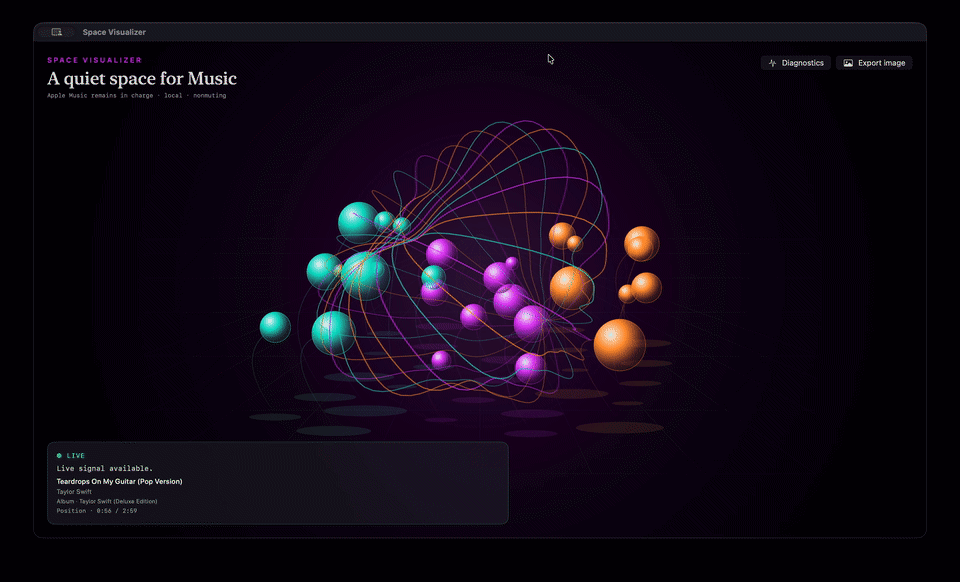

# Space Visualizer

### A quiet space for Music.

Space Visualizer is a native macOS companion for Apple Music that turns the music playing on your Mac into a live, audio-reactive visual scene. It follows playback automatically, bringing sound into motion while Apple Music remains in charge of listening.

## See it in action

_Click the preview to open the full-quality MP4._

## Features

- **Visuals driven by real audio** — the scene responds to the energy and frequency content of Music’s output, rather than a canned animation.
- **Automatic playback following** — follows playback and track changes, settling into a quiet waiting state when Music is paused or stopped.
- **An immersive canvas** — a spacious visual scene with minimal controls and display-synchronized rendering.
- **Now-playing details** — available song title, artist, album, and playback position appear alongside the visuals.
- **4K image export** — save the current scene as a 3840 × 2160 PNG with available track details, without capturing the screen or recording audio.
- **Uninterrupted listening** — does not mute Music, change the volume, skip tracks, or take over playback.
- **Window-aware activity** — capture and visualization suspend when the window is hidden or closed, and resume observation when it reopens.

## Made for Apple Music on Mac

Space Visualizer requires **macOS 14.2 or later** and the **Music app**. It is a visual companion, not a music player or a streaming service.

Automatic following uses two macOS permissions:

- **Automation** to read Music’s playback state and track details.
- **System Audio Recording** to analyze Music’s audio for visualization.

Permission requests begin only after automatic following is enabled. The app does not launch Music or start playback on its own.

## Local by design

Music audio is analyzed temporarily in memory—it is never saved or uploaded. Capture targets Music, not the microphone or other apps’ audio.

Space Visualizer requires no account, Apple ID sign-in, or network service of its own. Exported images contain the visual scene and available track details, never audio.

**Your music stays in Music. Space Visualizer gives it a space to move.**
